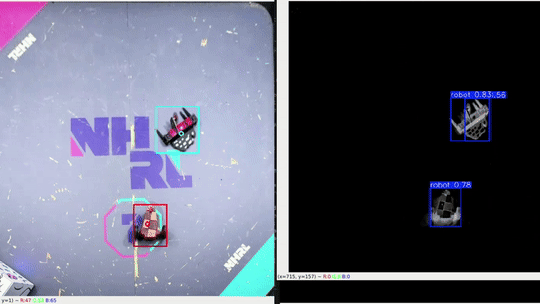

# Autonomous Combt Robot 
This is the repository for the autonomous robot project of Carnegie Mellon Combat Robotics. We aim to build an autonomous driving stack that controls the robot using external perception.

## Demos
only perception, as of now :< \
*GIF1: Tracking ourselves(cyan), Opponent (red), and identifying the referee bot (boxy white bot)*\
\
*GIF2: Tracking a diverse range of unseen robot designs using CNN-on-Foreground method*\



## Instructions
For the perception demo on saved videos, clone the repository and run:
```
pip install -r requirements.txt
```
Then go into folder "autonomousBot/externalPerception" and run: 
```
python subtraction_test.py
```
\
When an image (first frame of the video) appares, click on the four corners of the arena to calibrate the birds's-eye-view transformation parameters. Then close the window. Video with tracking should start playing. \
(Do not run from the root folder. That will give you a path error or "None type does not have... " error)

To save transformed (and unannotated) video, edit subtraction_test.py and change SAVEVIDEO to true. It saves the video to "output_video.mp4" by default


